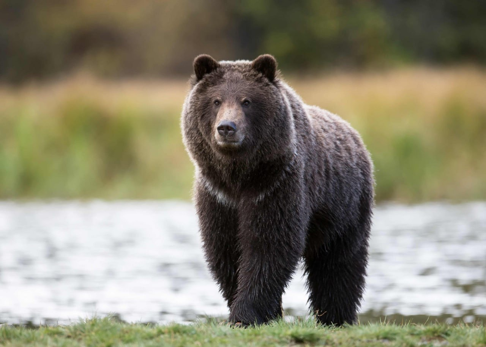
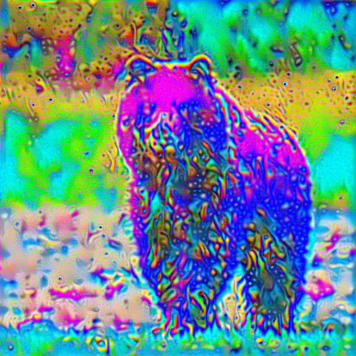

# Stylization of Images in the Telegram Bot

This project is a Telegram bot that enables users to apply artistic style transfer to their images. The bot utilizes neural style transfer techniques to transform the style of a content image based on a chosen style image. It provides a user-friendly interface for interacting with the bot and visualizing the stylized image results.

Bot name: [@imager_osv_bot](https://t.me/imager_osv_bot)

Author: Osipov Sergei

Stepik User ID: 46118894

## Example

| Input image | Style Image | Output Image |
|:-:|:-:|:-:|
|  |  |  |

## Built With

* **Python** - The programming language used.
  * **pytorch** - Machine learning library.
  * **aiogram** - Framework for Telegram Bot API.
  * **pillow** - Imaging processing library.
  * **matplotlib** - Plotting library.
* **Docker** - Containerization platform.

There are two ways to run the bot:
* without *Docker*
* with *Docker*

### Without Docker

#### Installation

0. [Install Python 3.11+](https://www.python.org/downloads/) and install dependencies with `pip install -r requirements.txt` or install them manually:
```bash
pip install --upgrade pip
pip install aiogram
pip install torch torchvision
pip install pillow
pip install matplotlib
```

1. Clone this repository:
    `git clone https://github.com/sergunyaklg/bot_dls_change_style.git`
2. Go to the project directory:
    `cd bot_dls_change_style`

### Usage

Run `python app.py`

### With Docker

#### Installation

**Prerequisites:**

* Docker installed. You can download Docker [here](https://www.docker.com/products/docker-desktop/).
* Create a new VM a cloud service (AWS, Yandex Cloud, VK Cloud and so on).

To run the Telegram bot locally:

1. Clone this repository:
    `git clone https://github.com/sergunyaklg/bot_dls_change_style.git`
2. Go to the project directory:
    `cd bot_dls_change_style`
3. Build Docker image:
    `docker build -t sergunyaklg/telegram-change-style-bot .`
4. Run Docker container:
    `docker run --env-file .env sergunyaklg/telegram-change-style-bot`

**Deployment:**

1. Log in to your Docker account:
    1. `docker login -u your-docker-username`
    2. Enter your password when prompted.
2. Tag your image for the DockerHub Registry:
    * `docker tag sergunyaklg/telegram-change-style-bot sergunyaklg/telegram-change-style-bot:latest`
3. Push your image to the DockerHub Registry:
    * `docker push sergunyaklg/telegram-change-style-bot:latest`
4. Go to Cloud and create a new VM or use an existing one.
5. Connect to your VM using ssh and pull the Docker image:
    * `ssh username@vm_ip`
    * `docker pull sergunyaklg/telegram-change-style-bot:latest`
6. Add a `.env` file to your VM with `TG_BOT_TOKEN=[place your Telegram token]`. You can use [.env.template](https://github.com/sergunyaklg/bot_dls_change_style/.env.template) as a template
7. Run the Docker container:
    * `docker run --env-file .env sergunyaklg/telegram-change-style-bot:latest`
